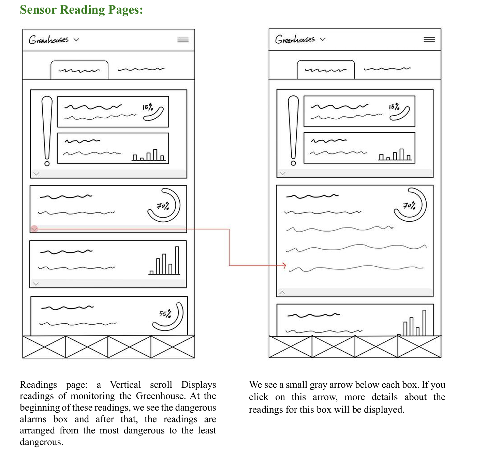
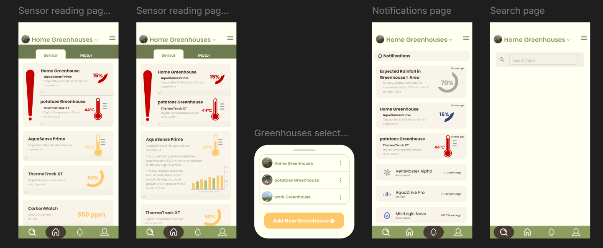
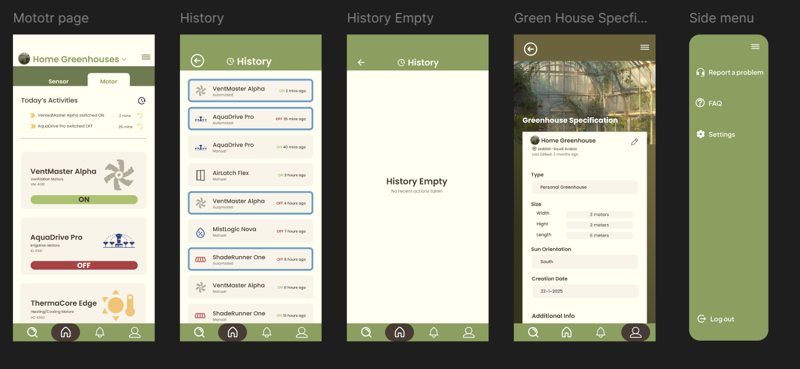

# SeedSync 
IoT-Powered Smart Greenhouse Management System

## Overview
SeedSync is an end-to-end mobile application that automates greenhouse management using IoT sensors and remote actuators. It enables real-time monitoring, automated responses, and offline-first data synchronization.

## Key Features
- Real-time monitoring (temperature, humidity, soil moisture, light, CO₂, pH, etc.)
- Remote actuator control (fans, pumps, HVAC, curtains)
- Offline-first data syncing
- Automated rule-based actions
- Multi-greenhouse dashboard

## Problem Statement
Greenhouse owners rely heavily on manual monitoring to maintain optimal growing conditions. This process is time-consuming, error-prone, and inefficient. SeedSync replaces manual oversight with automated, data-driven control.

## Target Users
- Greenhouse business owners
- Farm managers
- Home gardeners and hobbyists

## System Workflow
1. Sensor data collection via microcontroller  
2. Wi-Fi transmission to cloud  
3. Backend processing and storage  
4. Mobile app visualization  
5. Remote actuation via user commands

## UX / HCI Considerations
- Error prevention through constrained inputs
- Visibility via expandable sensor cards
- Prioritization of critical alerts
- Real-time system feedback

## Design Prototypes
- Low-fidelity wireframes
- High-fidelity interactive designs  
🔗 Figma Prototype: (https://www.figma.com/design/coRQ80n2HJ1Midos33r95y/SeedSync?node-id=0-1&t=U98KQ90GIQ5qQjGX-1)

## My Role
- UX research and interaction design
- Wireframing and prototyping in Figma
- Information architecture
- HCI principles application

## Design Snapshots

### Low-Fidelity Wireframes

### High-Fidelity Prototype

## Full Documentation
For a detailed project report, see [SeedSync Full Report](docs/SeedSync_Report.pdf)

## Course Context
Developed for **CCSW-225 – Human Computer Interaction**  
University of Jeddah, 2025
